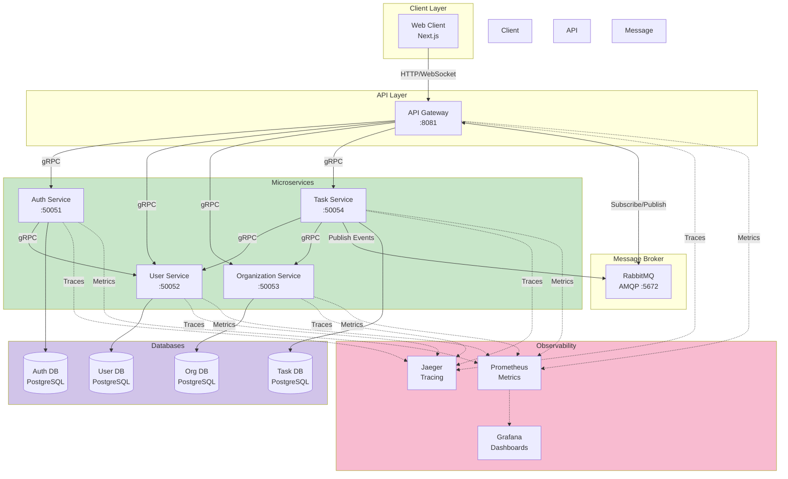

# High-Level Architecture

Complete system architecture showing all services, databases, and infrastructure components.

## Components

### Client Layer
- **Web Client**: Next.js React application served on port 3000

### API Layer
- **API Gateway**: Single entry point for all client requests (port 8081)
  - REST API endpoints
  - WebSocket server for real-time updates
  - JWT validation
  - Request routing

### Microservices
- **Auth Service** (port 50051): Authentication and authorization
- **User Service** (port 50052): User profile and role management
- **Organization Service** (port 50053): Organization and membership management
- **Task Service** (port 50054): Task CRUD and event publishing

### Message Broker
- **RabbitMQ**: Event-driven messaging for real-time updates

### Databases
- Each service has its own PostgreSQL database
- Independent data stores for service isolation

### Observability
- **Jaeger**: Distributed tracing across all services
- **Prometheus**: Metrics collection
- **Grafana**: Visualization and dashboards
