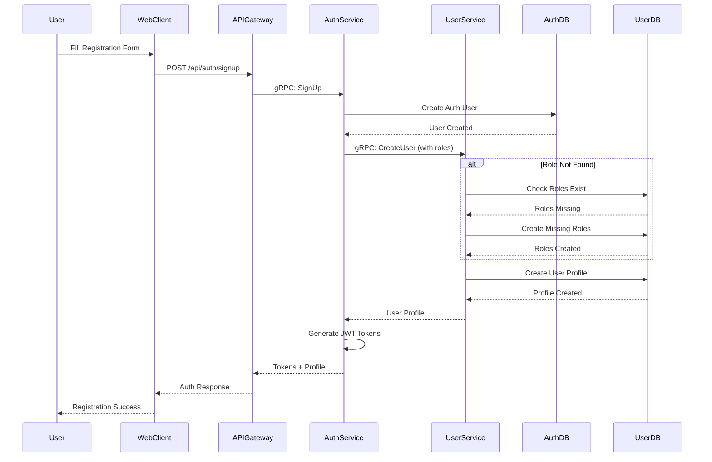

# User Registration Flow

Complete flow for new user registration including role auto-creation.

## Process Steps

1. **User Input**: User fills out registration form (email, password, name)
2. **API Request**: Web client sends POST to `/api/auth/signup`
3. **Auth Creation**: Auth service creates credentials in auth database
4. **Profile Creation**: Auth service calls user service to create profile
5. **Role Management**: User service automatically creates missing roles if needed
6. **Token Generation**: Auth service generates JWT access and refresh tokens
7. **Response**: User receives tokens and profile information

## Auto-Role Creation

The system automatically creates roles ("admin", "user", "guest") if they don't exist in the database, preventing registration failures due to missing seed data.

## Security

- Passwords are hashed using bcrypt before storage
- JWT tokens include user ID, email, and user type
- Access token expires in 1 hour
- Refresh token expires in 30 days
