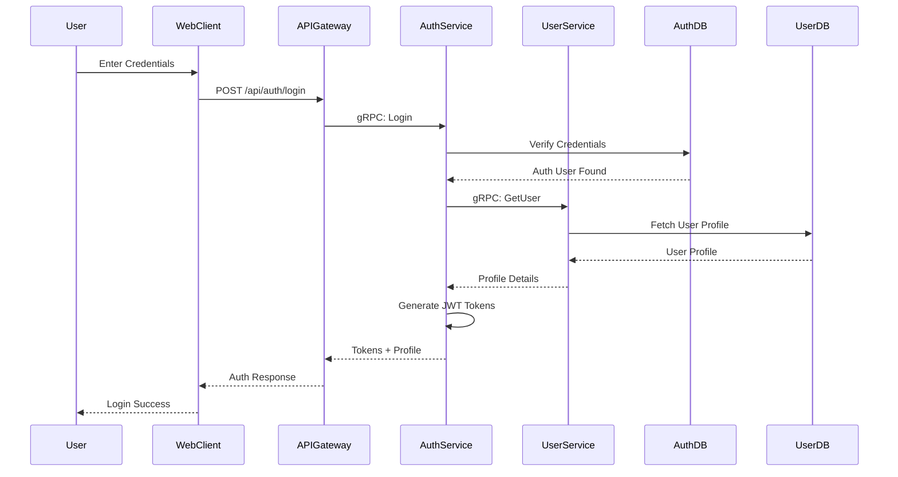

# User Login Flow

Authentication flow for existing users.

## Process Steps

1. **Credentials**: User enters email and password
2. **API Request**: Web client sends POST to `/api/auth/login`
3. **Verification**: Auth service verifies password hash against database
4. **Profile Fetch**: Auth service retrieves full user profile from user service
5. **Token Generation**: New JWT tokens are generated
6. **Response**: User receives fresh tokens and complete profile

## Token Management

- **Access Token**: Short-lived (1 hour) for API access
- **Refresh Token**: Long-lived (30 days) for getting new access tokens
- Both tokens stored securely in HTTP-only cookies

## Error Handling

- Invalid credentials return 401 Unauthorized
- Disabled accounts return appropriate error
- Failed login attempts are logged for security monitoring
