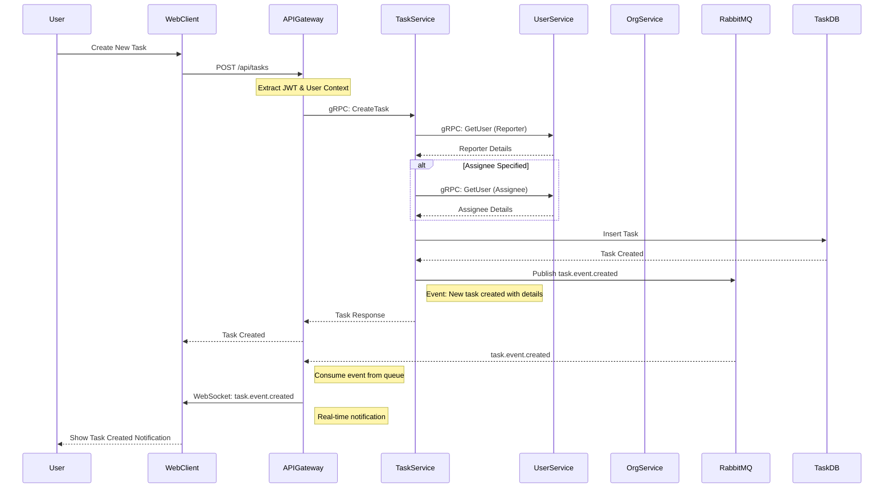

# Task Creation Flow

Complete flow for creating a new task with real-time notifications.



## Process Steps

1. **Task Input**: User fills task form (title, description, assignee, priority, due date)
2. **Authentication**: API Gateway extracts user context from JWT
3. **User Details**: Task service fetches reporter and assignee details
4. **Database Insert**: Task saved to task database
5. **Event Publishing**: Task creation event published to RabbitMQ
6. **HTTP Response**: Immediate response to web client
7. **Real-time Update**: Event consumed and broadcast via WebSocket to all organization members

## Event Payload

```json
{
  "event_type": "task.event.created",
  "organization_id": "uuid",
  "data": {
    "task_id": "uuid",
    "title": "Task Title",
    "description": "Description",
    "status": "open",
    "priority": "high",
    "assignee": { "id": "uuid", "first_name": "John", "last_name": "Doe" },
    "reporter": { "id": "uuid", "first_name": "Jane", "last_name": "Smith" },
    "due_at": "2025-12-31T23:59:59Z"
  }
}
```

## Real-Time Features

- All organization members receive instant notification
- WebSocket connection maintains live updates
- No polling required for task list refresh
