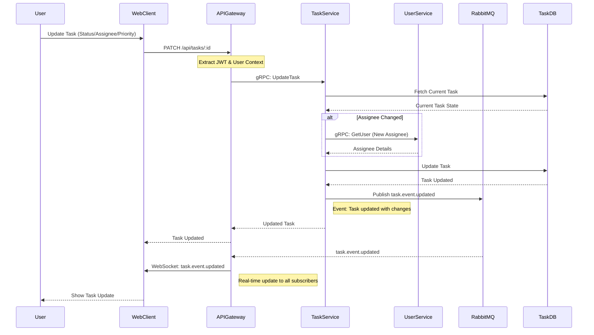

# Task Update Flow

Flow for updating task status, assignee, priority, or other fields.



## Process Steps

1. **Update Request**: User changes task field (status, assignee, priority, etc.)
2. **API Call**: PATCH request sent to `/api/tasks/:id`
3. **Fetch Current State**: Task service retrieves current task data
4. **Validation**: New values validated and assignee details fetched if changed
5. **Database Update**: Task updated in database
6. **Event Publishing**: Update event published to RabbitMQ
7. **Real-time Broadcast**: All organization members receive instant update

## Updatable Fields

- **Status**: open, in_progress, completed, blocked, cancelled
- **Priority**: low, medium, high, urgent
- **Assignee**: Change task assignment
- **Title**: Edit task title
- **Description**: Update task details
- **Due Date**: Modify deadline

## Event Payload

```json
{
  "event_type": "task.event.updated",
  "organization_id": "uuid",
  "data": {
    "task_id": "uuid",
    "title": "Updated Title",
    "status": "in_progress",
    "priority": "high",
    "assignee": { "id": "uuid", "first_name": "John", "last_name": "Doe" },
    "triggered_by": { "id": "uuid", "first_name": "Admin", "last_name": "User" }
  }
}
```

## Real-Time Synchronization

- Changes instantly reflected across all connected clients
- No conflicts due to single source of truth (database)
- Optimistic UI updates with server confirmation
