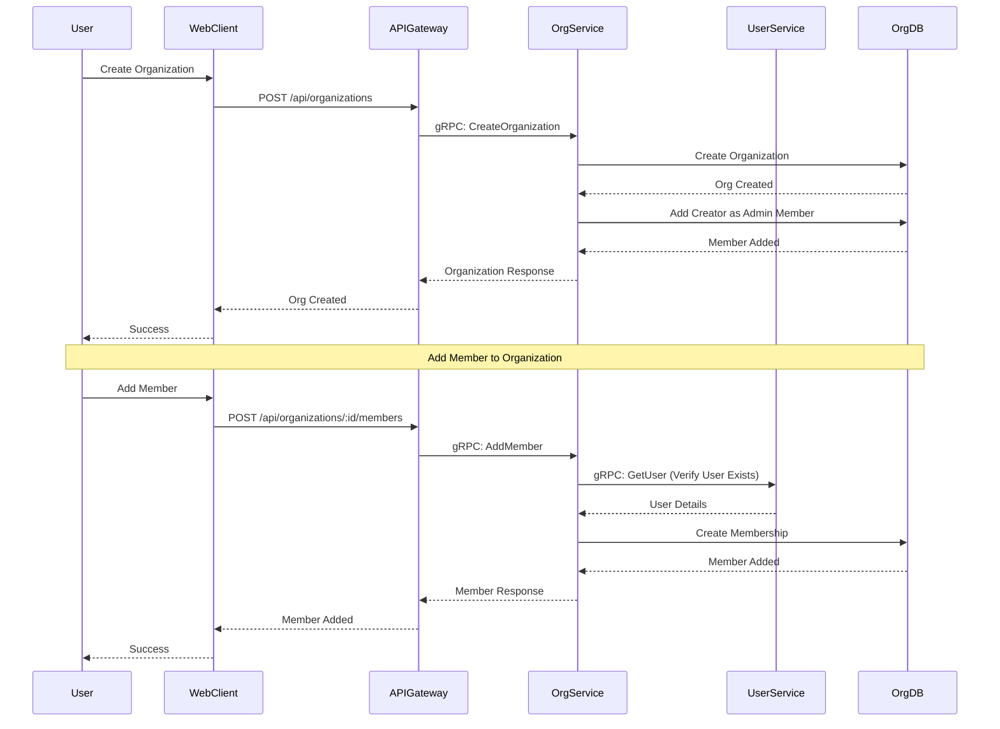

# Organization Management Flow

Organization creation and member management flows.

## Organization Operations

### Create Organization
1. User provides organization name and description
2. Organization created in database
3. Creator automatically added as admin member
4. Organization ID returned for future operations

### Add Member
1. Admin provides user email or ID
2. User service verifies user exists
3. Membership created with specified role
4. Member can now access organization resources

### Member Roles
- **admin**: Full control (add/remove members, delete org)
- **member**: Standard access (create/edit tasks)
- **viewer**: Read-only access

### List Organizations
- Users can list organizations they belong to
- Filter by membership role
- Pagination support for large lists

## Authorization

- Only organization admins can add/remove members
- Only organization admins can delete organization
- All organization members can create tasks
- Task access restricted to organization members
