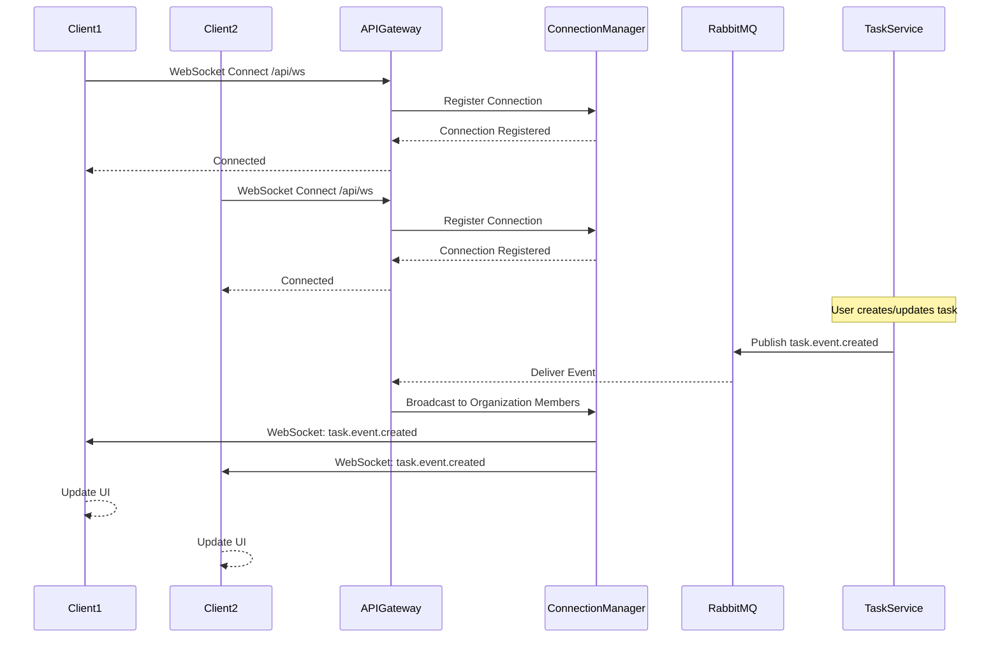

# WebSocket Real-Time Communication

Real-time bidirectional communication between server and clients.



## Connection Management

### Connection Flow
1. Client establishes WebSocket connection to `/api/ws`
2. Connection authenticated using JWT token
3. Connection registered in ConnectionManager with user context
4. Heartbeat/ping-pong maintains connection alive

### Connection Registry
- Tracks active connections per user
- Maintains organization membership mapping
- Handles reconnection and cleanup

## Message Broadcasting

### Filtering
- Events filtered by organization membership
- Only relevant users receive notifications
- Reduces unnecessary network traffic

### Message Types
- **task.event.created**: New task notification
- **task.event.updated**: Task update notification
- **connection.established**: Connection confirmation
- **ping/pong**: Keep-alive messages

## Client-Side Handling

### Connection
```javascript
const ws = new WebSocket('ws://localhost:8081/api/ws');

ws.onopen = () => {
  console.log('Connected');
};

ws.onmessage = (event) => {
  const message = JSON.parse(event.data);
  handleEvent(message);
};

ws.onerror = (error) => {
  console.error('WebSocket error:', error);
};

ws.onclose = () => {
  console.log('Disconnected');
  // Implement reconnection logic
};
```

### Event Handling
```javascript
function handleEvent(message) {
  switch (message.event_type) {
    case 'task.event.created':
      addTaskToList(message.data);
      showNotification('New task created');
      break;
    case 'task.event.updated':
      updateTaskInList(message.data);
      showNotification('Task updated');
      break;
  }
}
```

## Scalability Considerations

### Multiple Instances
- Connection manager can be distributed
- Redis pub/sub for cross-instance communication
- Consistent hashing for connection distribution

### Load Balancing
- WebSocket connections are sticky
- Load balancer must support WebSocket protocol
- Health checks for active connections

### Connection Limits
- Monitor concurrent connections per instance
- Implement backpressure if limits reached
- Graceful degradation to polling if needed

## Error Handling

### Reconnection Strategy
- Exponential backoff for reconnection attempts
- Maximum retry limit
- Fallback to HTTP polling if WebSocket fails

### Connection Drops
- Automatic cleanup of stale connections
- Heartbeat timeout detection
- Client-side reconnection logic

## Security

- JWT authentication on connection
- User context validated on each broadcast
- Organization membership verified
- Rate limiting on message sending
