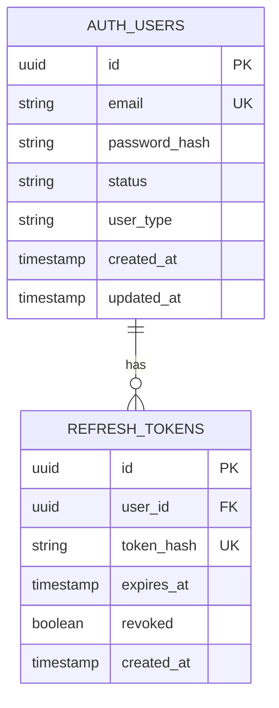
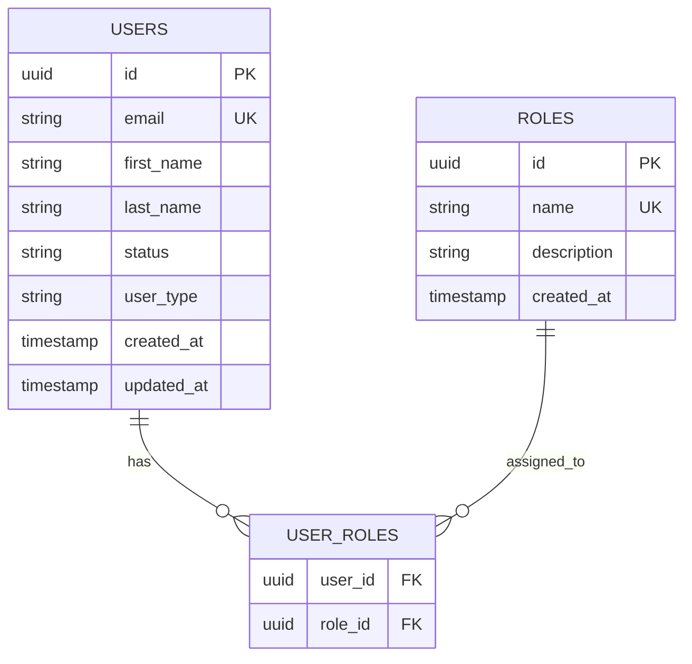
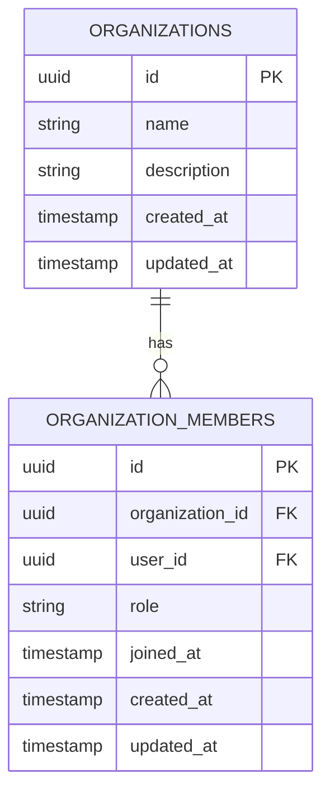
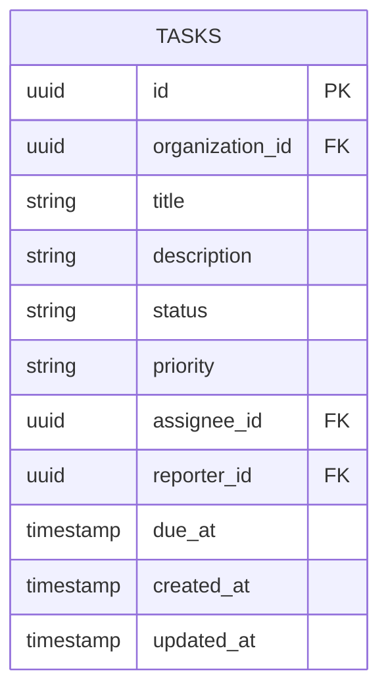

# Database Schemas

Entity-relationship diagrams for all service databases.

## Auth Service Database

### Auth Users Table
- Stores authentication credentials
- Email is unique constraint
- Password stored as bcrypt hash
- Status: active, disabled, pending
- User type: admin, user

### Refresh Tokens Table
- Stores refresh token hashes
- One user can have multiple tokens (different devices)
- Tokens can be revoked
- Automatic cleanup of expired tokens

---

## User Service Database

### Users Table
- User profile information
- Email matches auth service
- First and last name for display
- Status and type for permissions

### Roles Table
- Predefined roles: admin, user, guest
- Auto-created if missing during user creation
- Extensible for custom roles

### User Roles Table
- Many-to-many relationship
- Users can have multiple roles
- Roles can be assigned to multiple users

---

## Organization Service Database

### Organizations Table
- Organization metadata
- Name and description
- Created by field (not shown) tracks creator

### Organization Members Table
- Links users to organizations
- Role: admin, member, viewer
- Joined timestamp for analytics
- Composite unique constraint on (organization_id, user_id)

---

## Task Service Database

### Tasks Table
- Task information and metadata
- Organization ID for access control
- Status: open, in_progress, completed, blocked, cancelled
- Priority: low, medium, high, urgent
- Assignee and reporter reference users (not foreign keys to avoid cross-db dependencies)
- Due date optional
- Indexed on organization_id and status for efficient queries

---

## Database Isolation

Each service has its own database to:
- **Independence**: Services can be deployed separately
- **Scalability**: Databases can scale independently
- **Resilience**: Failure in one database doesn't affect others
- **Technology Choice**: Each service can use optimal database technology

## Data Consistency

- **User IDs** are shared across services but not enforced by foreign keys
- **Eventual Consistency** through event-driven updates
- **Idempotency** in event handlers to handle duplicate messages
- **Compensation** mechanisms for failed operations

## Migrations

- Each service manages its own migrations
- **GORM AutoMigrate** used for development
- Production should use versioned migration tools (e.g., golang-migrate)
- Backward-compatible schema changes

## Backup Strategy

- Regular automated backups per database
- Point-in-time recovery enabled
- Backup retention policy (30 days)
- Regular restore testing
